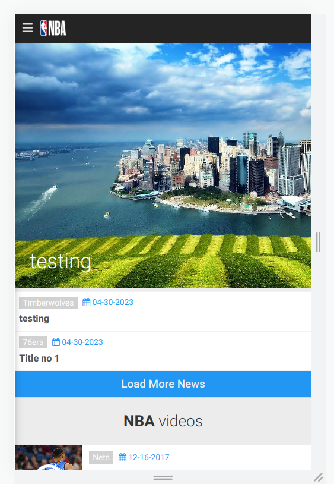
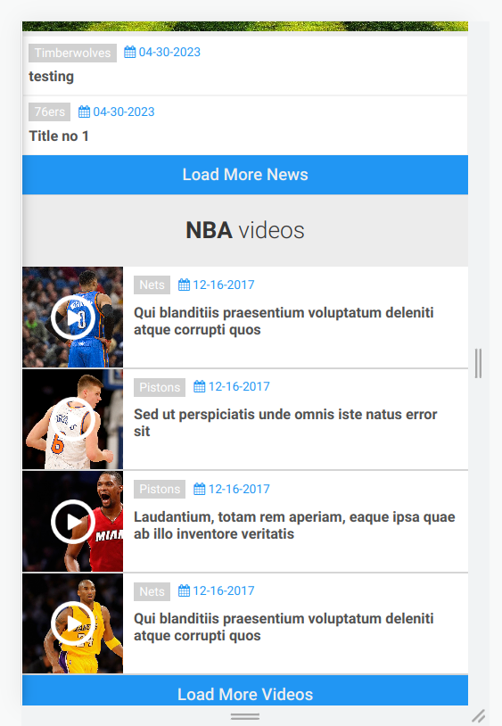
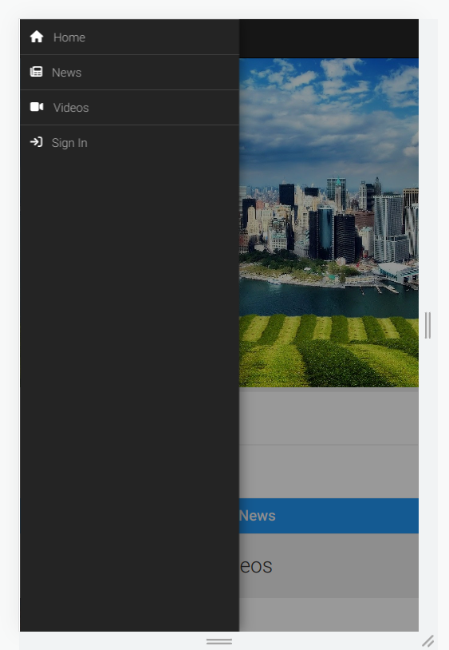
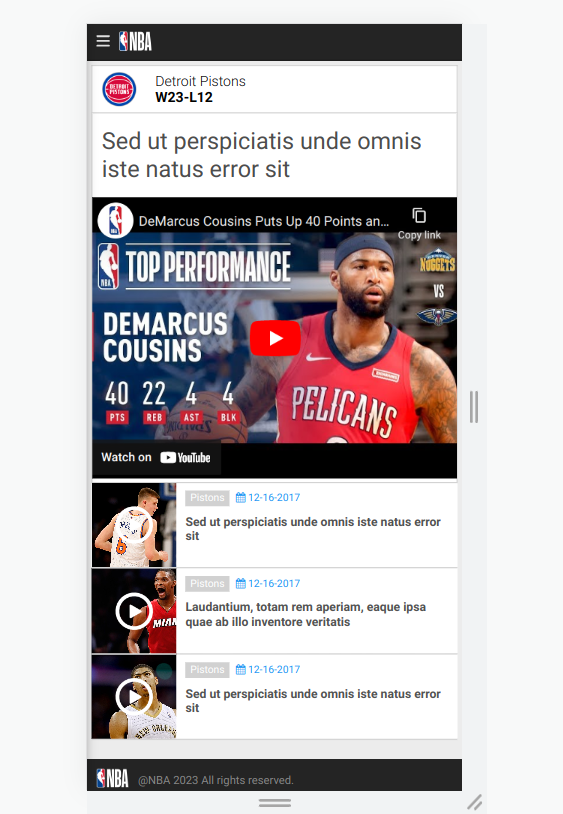

# Learning-React And FIREBASE 

Firebase Hosting url : https://nba-app-1f2ef.firebaseapp.com/

**I designed for mobile. So this will be a perfect one on mobile**

</img>
</img> 
</img>
</img>
  

   > Connect With Me on :arrow_right: [LinkedIn](https://www.linkedin.com/in/phyoewaiaung082/)
